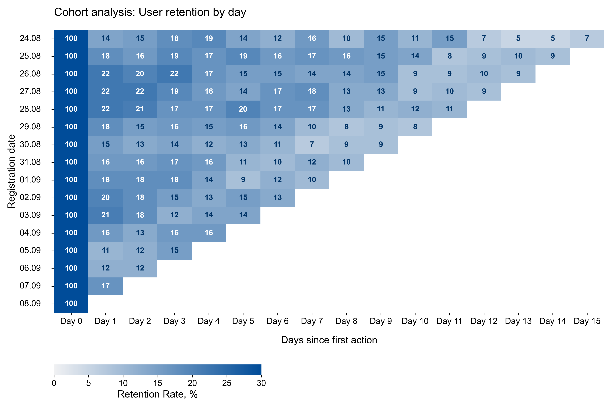
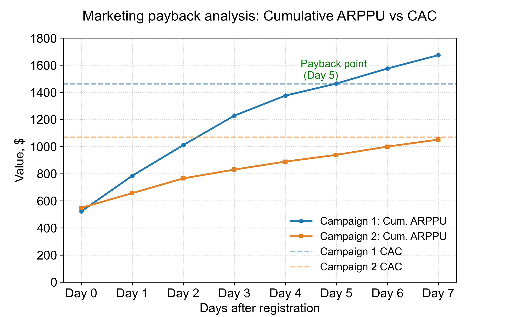
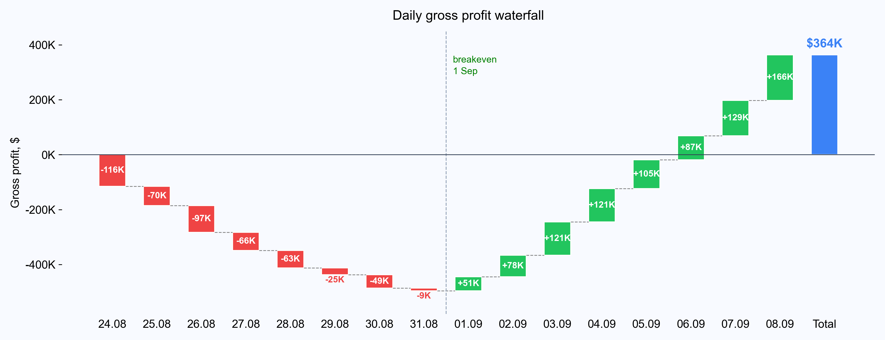
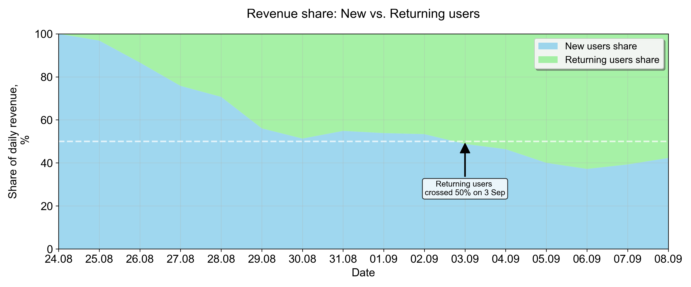

# Delivery Service Analytics

> SQL analysis of a food delivery service (Aug 24 – Sep 8, 2022):
> revenue growth, marketing ROI, cohort retention, and P&L.
> PostgreSQL · Window functions · CTEs · Python visualisations

---

## Overview

This project analyses 16 days of operational data from a food delivery service launched in August 2022.
The dataset covers orders, users, couriers, and products across 6 tables in PostgreSQL.

The analysis is structured into four blocks, each answering a specific business question:

| Block | Focus | Key question |
|---|---|---|
| 1 | Revenue & Growth | How fast is the service growing and what drives it? |
| 2 | Marketing ROI | Which ad campaign was worth the budget? |
| 3 | Retention & Engagement | Are users coming back? |
| 4 | Operational Metrics | When did the service become profitable? |

---

## Key Findings

**Revenue** grew 42× in 16 days ($50k → $2.1M/day). Growth came entirely from more users and more orders — AOV stayed flat at ~$383 throughout.

**Marketing:** Two campaigns launched Sep 1, each with a $250,000 budget. Campaign 1 (YouTube, 171 users) reached payback on Day 5 with ROI +14.5%. Campaign 2 (social ads, 236 users) never reached payback — ROI −1.6%. The gap is explained by retention, not order size: Day 1 retention was 42% vs 17%.

**Retention:** Day 1 retention across all cohorts: 12–22%. A stable loyal core of ~10–12% remains active after 1–2 weeks.

**P&L:** The service operated at a daily loss for the first 8 days due to fixed warehouse costs ($120k/day). Daily profit turned positive on Sep 1. Cumulative breakeven: Sep 6.

---

## Visualisations

### Cohort Retention Heatmap
Each row is a cohort (users who registered on the same day). Each column shows what % returned on that day after registration. The triangular shape is expected — later cohorts have fewer days of observation.



---

### Marketing Payback Analysis
Dashed lines = CAC (fixed acquisition cost). Curves = cumulative revenue per paying user. The point where the curve crosses the dashed line = payback day.



---

### Daily Gross Profit Waterfall
Each bar shows daily profit or loss. Connector lines show the running cumulative total. The breakeven line marks Sep 1 — the first day the service turned a daily profit.



---

### Revenue Share: New vs Returning Users
On Aug 24, 100% of revenue came from new users. By Sep 3, returning users crossed 50%. By Sep 8 their share reached 58% — the platform is building a loyal repeat-purchase base.



---

## SQL Techniques Used

| Technique | Where applied |
|---|---|
| `SUM() OVER (ORDER BY date)` | Cumulative revenue, running ARPU, payback analysis |
| `LAG()` | Day-over-day revenue growth, user growth rates |
| `UNNEST(product_ids)` | Expanding product arrays to calculate revenue and VAT |
| Cohort analysis | Retention heatmap, campaign retention D1 / D7 |
| `FILTER (WHERE action = ...)` | Excluding cancelled orders across all queries |
| `DATE_PART`, `TO_CHAR` | Weekday analysis, date formatting |
| CTEs (`WITH`) | Gross profit P&L, running ARPU, growth rates |

---

## Database Schema

Six tables in PostgreSQL. Products are stored as an integer array in the `orders` table — `UNNEST(product_ids)` is used to join with the `products` table and calculate revenue.

```
products          — product catalogue
users             — registered users
orders            — orders placed (product_ids stored as INTEGER[])
user_actions      — create_order / cancel_order events
couriers          — registered couriers
courier_actions   — accept_order / deliver_order events
```

Full schema with sample data: [`schema.sql`](schema.sql)

---

## Project Structure

```
delivery-service-analytics/
│
├── README.md
├── delivery_analytics.ipynb   ← all charts and insights
├── schema.sql                 ← database schema + sample data
│
├── sql/
│   ├── 01_revenue/
│   ├── 02_marketing/
│   ├── 03_retention/
│   └── 04_operations/
│
├── data/
│   ├── 01-revenue/
│   ├── 02-marketing/
│   ├── 03-retention/
│   └── 04-operations/
│
└── charts/                    ← images used in this README
```

---

## Tools

- **PostgreSQL** — all queries
- **Python** — pandas, matplotlib, seaborn
- **Jupyter Notebook** — analysis and visualisations
