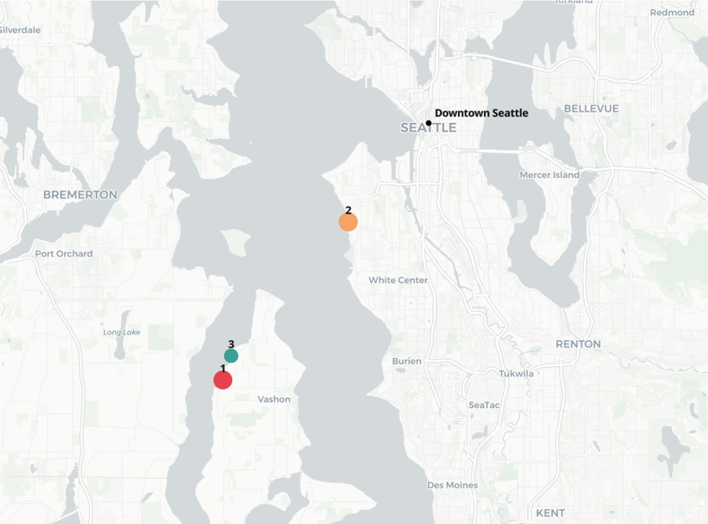

# King County House Sales — Exploratory Data Analysis



Exploratory data analysis of the King County (Seattle, WA) real estate market.  
The goal is to understand price drivers, test market hypotheses, and find properties matching a client's requirements.

---

## Project Structure

| Notebook | Description |
|----------|-------------|
| `1_Fetching_the_data_eda.ipynb` | Connecting to PostgreSQL, retrieving data via SQL JOIN, exporting to CSV |
| `2_Data_exploration.ipynb` | Data cleaning, missing values, duplicates, correlation analysis, price distribution |
| `3_Data_relationship.ipynb` | Hypothesis testing: seasonality, price stability, North vs South |
| `4_data_example.ipynb` | Client case: filtering and scoring properties for Larry Sanders |
| `app.py` | Streamlit dashboard — visual summary of the EDA results |

---

## Dataset

**Source:** King County House Sales — public open data via Kaggle  
**Period:** May 2014 – May 2015  
**Original records:** 21,597  
**After cleaning:** 20,818  
**Attributes:** 21 original + 5 engineered

**Retrieved via SQL JOIN from PostgreSQL database → exported to CSV**

```sql
SELECT kchd.*, kchs.date, kchs.price
FROM king_county_house_details kchd
LEFT JOIN king_county_house_sales kchs
ON kchd.id = kchs.house_id;
```

---

## Data Cleaning

| Issue | Solution |
|-------|----------|
| Missing values: `waterfront`, `view`, `yr_renovated` | Filled with 0 — absence of feature |
| Missing values: `sqft_basement` | Computed: `sqft_living - sqft_above` |
| Duplicate sales (same coordinates + area) | Kept only the most recent sale — 779 records removed |

---

## Engineered Features

| Feature | Description |
|---------|-------------|
| `price_per_sqft` | `price / sqft_living` — normalized price for fair comparison |
| `region` | North / South split by median latitude — for H3 |
| `season` | Winter / Spring / Summer / Autumn — for H1 |
| `year_month` | String `YYYY-MM` — for time series |
| `distance_to_center` | Euclidean distance to downtown Seattle (47.606° N, 122.33° W) |

---

## Hypotheses

| # | Hypothesis | Result |
|---|-----------|--------|
| H1 | Peak demand in spring and autumn, drop in summer and winter | Partially confirmed — peak is spring and summer |
| H2 | Nov–Dec sales have higher prices than Jan–Feb | Not confirmed — prices are stable year-round |
| H3 | Northern part of the region is more expensive than the south | Confirmed — higher price/sqft and wider price range in the north |

---

## Key Findings

- **Living area** is the strongest price predictor — Pearson r = 0.70
- **Construction grade** is the second strongest — r = 0.67
- Price range: **$78K – $7.7M**, average **$540K**
- North King County has higher price per sqft and more premium-class properties

---

## Client Case: Larry Sanders

**Requirements:** waterfront view · limited budget · privacy · fewer families with children · central location

**Filtering approach:**
1. `waterfront == 1`
2. `price < median(waterfront properties)`
3. `sqft_lot15 >= 75th percentile` — large neighbouring lots
4. `bedrooms == 2 or 3` — less family-oriented
5. `distance_to_center <= median` — closest to downtown Seattle

**Result:** 8 properties matched all 5 filters  
**Top 3** selected by weighted score (price 35% · distance 35% · privacy 15% · area 15%)

---

## Results

- Living area is the strongest price predictor — Pearson r = 0.70
- North King County has higher price per sqft, wider price range, and more premium-class properties
- No significant variation in median or average sale price throughout the year
- **8 properties** matched all 5 client filters
- **Top 3** selected by weighted score (price · distance · living area · privacy)
- **Rank 1** — $1.18M · 1,970 sqft · 8.5 km from downtown Seattle · waterfront

---

## Tech Stack

| Tool | Usage |
|------|-------|
| `pandas` | Data loading, cleaning, filtering, grouping |
| `numpy` | Math operations, distance calculation |
| `matplotlib` / `seaborn` | Static charts: boxplot, heatmap, scatter |
| `plotly.express` | Interactive charts: scatter_mapbox for property map |
| `psycopg2` / `sqlalchemy` | PostgreSQL connection |
| `jupyter notebook` | Development and documentation |
| `streamlit` | Interactive dashboard |

---

## Requirements

- pyenv
- python == 3.11.3

## Setup

```bash
pyenv local 3.11.3
python -m venv .venv
source .venv/bin/activate  # Windows: .venv\Scripts\activate
pip install --upgrade pip
pip install -r requirements.txt
```
