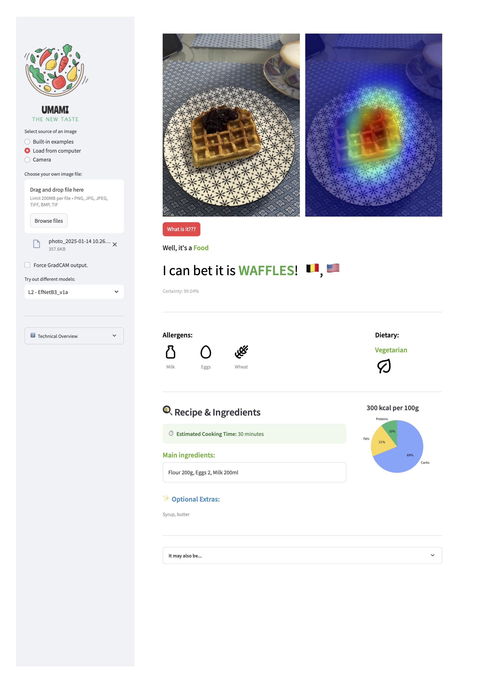
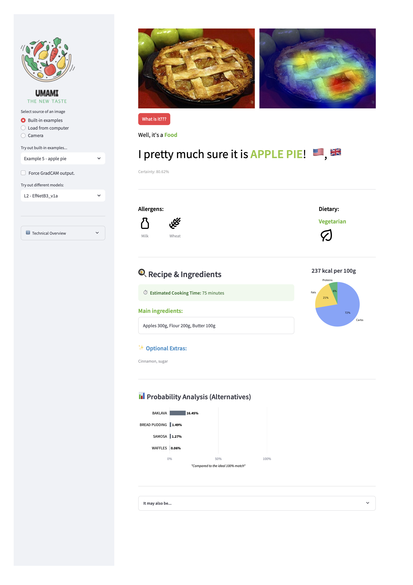
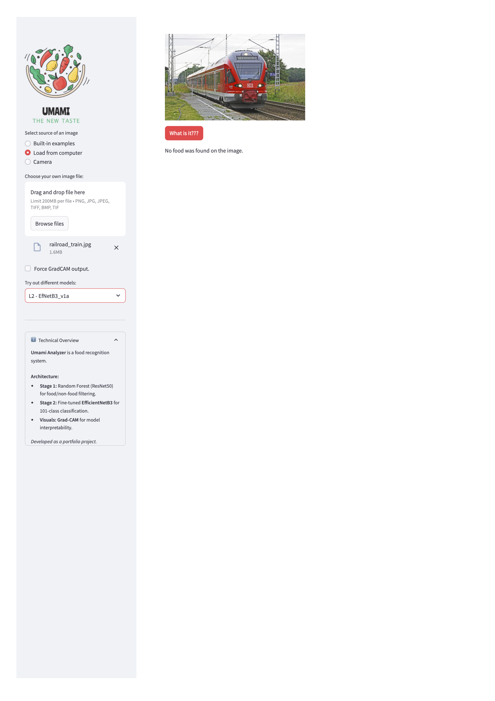

# UMAMI — Food Recognition & Nutritional Analysis


> **Take a photo of any food — get the dish name, nutritional info, allergen flags, and a visual explanation of the model's decision.**

---

 ## Screenshots

**High-confidence prediction with Grad-CAM heatmap and allergen flags:**

**Medium-confidence prediction with probability distribution of alternatives:**

**Non-food image — L1 filter correctly rejects the input:**



---

## What It Does

UMAMI is a two-stage deep learning pipeline for food image classification and nutritional analysis.

1. **Upload a photo** — any food image from your phone or computer
2. **Stage 1 filters** — is this food at all? (98% accuracy, runs on CPU)
3. **Stage 2 classifies** — which of 101 dishes is it? (~75% Top-1 accuracy)
4. **You get** — dish name, calories, macronutrients, allergen warnings, and a Grad-CAM heatmap showing what the model focused on

---

## Performance

| Stage | Model | Task | Accuracy |
|-------|-------|------|----------|
| L1 Filter | ResNet50 + Random Forest | Food vs. Non-Food | **98%** (Precision 0.99 / F1 0.98) |
| L2 Classifier | EfficientNetB3 (fine-tuned) | 101-class dish recognition | **~75% Top-1** |

> Inference time on CPU: ~2–3s (L1) + ~5–6s (L2) = ~7–10s total.
> With GPU or TFLite quantization, significant speedup is possible.

---

## Architecture

```
Input Image
    │
    ▼
┌─────────────────────────────────────────┐
│  L1 — Binary Filter (ResNet50 + RF)     │  ← Fast, CPU-only gatekeeper
│  "Is this food?"                        │
└────────────────────┬────────────────────┘
                     │ Food ✓
                     ▼
┌─────────────────────────────────────────┐
│  L2 — Multi-class CNN (EfficientNetB3)  │  ← Fine-tuned on Food-101
│  "Which of 101 dishes is this?"         │
└────────────────────┬────────────────────┘
                     │
                     ▼
          Dish name + Nutrients
          + Allergens + Grad-CAM
```

**Why two stages?**
Running a full CNN on every image — including selfies and landscapes — wastes compute. The lightweight L1 filter costs milliseconds and discards non-food inputs before they reach the expensive L2 model.

---

## Datasets

| Dataset | Images | Categories | Used For |
|---------|--------|------------|----------|
| Food5K | 5,000 | 2 (food / not food) | L1 filter training |
| Food-101 | 101,000 | 101 dishes | L2 classifier fine-tuning |

---

## 🔍 Explainability: Grad-CAM

After every prediction, the system generates a **Gradient-weighted Class Activation Map** — a heatmap overlaid on the original image that shows which pixels drove the model's decision.

- 🔴 Red = high attention
- 🔵 Blue = low attention

If the model says *"spaghetti bolognese"* and the heatmap highlights the pasta and sauce — the prediction is trustworthy. If it highlights the plate rim — something is off.

---

## Honest Limitations

This system provides **estimates based on dish name**, not a chemical analysis of your specific plate.
Nutritional values come from standard food databases matched to the predicted category.

**Known failure cases:**
- Visually similar dishes (e.g. gnocchi ↔ shrimp and grits — both are small brown pieces in sauce)
- Unusual camera angles that remove distinctive visual cues
- Dishes where plating style varies significantly from training data

UMAMI is a useful starting point — not a substitute for a food label or a dietitian.

---

## Tech Stack

| Category | Technologies |
|----------|-------------|
| Machine Learning | TensorFlow 2.x, Keras, Scikit-learn |
| Computer Vision | EfficientNetB3, ResNet50, Grad-CAM |
| Data Analysis | Pandas, NumPy, Matplotlib, Seaborn |
| Deployment | Streamlit |
| Serialization | Keras `.keras`, Scikit-learn `.pkl` (joblib) |

---

## Project Structure

```
umami/
├── app.py                  # Streamlit entry point
├── models/                 # Not included — see note below
├── notebooks/
│   └── EFNet_B0_training.ipynb         # Model training 
├── data/
│   ├── food-101/
│   │   └── Final_table_dish_info.csv  # Nutritional facts + allergens
│   └── *.jpg                       # Built-in example images
├── images/                         # UI assets and logos
└── requirements.txt
```

---


> **Deployment:** The app runs locally only. Pre-trained model files are not included in this repository due to size constraints, so the app cannot be launched from this repo directly. Training process is documented in `notebooks/`.

---

*Portfolio project — Nadezhda Semenova · March 2025 · [LinkedIn](https://www.linkedin.com/in/nadezhda-semenova-v/)*
